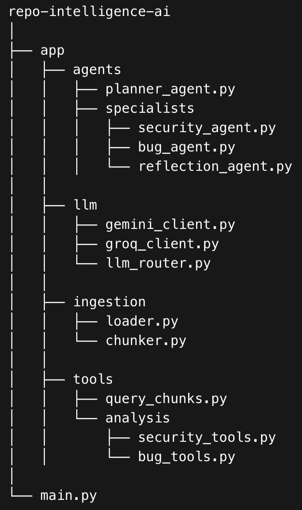

Autonomous Multi-Agent Repository Intelligence System

An Agentic AI system that analyzes software repositories to detect bugs, security vulnerabilities, and code issues using multi-agent reasoning, Retrieval-Augmented Generation (RAG), vector search, and tool-driven analysis.

The system uses a Planner Agent to orchestrate specialized agents that inspect repository code and generate verified analysis results.

Overview

This project implements an autonomous AI code analysis pipeline capable of:

Understanding repository code using semantic search

Running iterative security and bug analysis agents

Executing tool-driven code checks

Verifying results through a Reflection Agent

Producing a consolidated analysis report

The system demonstrates a modular Agentic AI architecture combining LLM reasoning with deterministic tools.

Architecture
Repository
     ↓
Code Ingestion
     ↓
Chunking + Embedding
     ↓
Chroma Vector Database
     ↓
Planner Agent
     ↓
Security Agent
     ↓
Bug Agent
     ↓
Reflection Agent
     ↓
Final Analysis Report
Core Features
Multi-Agent Architecture

The system uses a Planner Agent to orchestrate specialized agents responsible for analyzing repository code.

Agents collaborate using a shared context memory to pass observations and findings.

Retrieval-Augmented Generation (RAG)

The system retrieves relevant code snippets from a repository before performing analysis.

Pipeline:

Repository → Code Chunking → Embeddings → Vector DB → Semantic Search

This enables agents to analyze only the relevant parts of large repositories.

Vector Database Integration

Code embeddings are stored in ChromaDB enabling:

Semantic code search

Efficient retrieval across large repositories

Context-aware agent reasoning

AST-Based Code Analysis

The system integrates Abstract Syntax Tree (AST) parsing to analyze program structure and improve code reasoning beyond plain text.

AST analysis allows:

Syntax validation

Structural code understanding

Detection of logical issues

Tool-Driven Agent Reasoning

Specialist agents execute deterministic tools for analysis instead of relying solely on LLM reasoning.

Example tools:

Security Analysis

SQL injection detection

Hardcoded secret detection

Command injection detection

Bug Detection

Syntax validation

Infinite loop detection

Static code analysis

Agents iterate using:

Think → Select Tool → Execute → Observe → Repeat
Multi-LLM Routing

The system integrates multiple LLM providers with automatic fallback.

Current routing:

Primary LLM → Gemini
Fallback LLM → Groq (LLaMA models)

Benefits:

Increased reliability

Cost-efficient inference

Reduced downtime

Reflection Agent

The Reflection Agent validates results generated by specialist agents.

Responsibilities:

Verify detected vulnerabilities

Remove false positives

Combine bug and security findings

Generate a consolidated report

This significantly reduces LLM hallucinations.

Agent Workflow

Typical agent execution:

Step 1 → query_chunks
Retrieve relevant code from repository

Step 2 → security_agent
Analyze code for vulnerabilities

Step 3 → bug_agent
Detect logical errors and syntax issues

Step 4 → reflection_agent
Validate findings and combine results

Step 5 → finish
Return final report
Example Output
Security Findings:
No vulnerabilities detected.

Bug Findings:
Syntax error detected in authentication module.

Reflection Agent Summary:
Verified Issue:
- Unexpected indentation causing syntax error

Severity: Medium
Tech Stack

Programming Languages

Python

JavaScript

Java

AI & LLM Technologies

Agentic AI Systems

Multi-Agent Architecture

Retrieval-Augmented Generation (RAG)

Gemini API

Groq API

LLM Prompt Engineering

AI Agent Orchestration

Planner Agent

Security Agent

Bug Agent

Reflection Agent

Tool-Driven Agents

Backend

FastAPI

REST APIs

Asynchronous Processing

Databases

PostgreSQL

MySQL

ChromaDB

FAISS

Tools & DevOps

Git

Docker

Postman

AWS (Fundamentals)

Vercel

Repository Structure

How to Run

Install dependencies

pip install -r requirements.txt

Run the system

python main.py

The system will:

Ingest repository code

Create embeddings

Store vectors in ChromaDB

Execute multi-agent analysis

Generate final report

Future Improvements

Planned features:

Fix Agent for automatic code repair

AST-aware code chunking

Advanced static analysis tools

GitHub Pull Request integration

Repository-level reasoning

Multi-language code support

Project Goals

This project demonstrates how Agentic AI systems can combine:

LLM reasoning

deterministic tools

semantic retrieval

multi-agent collaboration

to build autonomous software analysis systems.